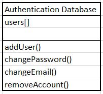
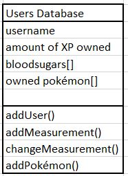
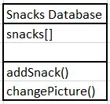

# How to Implement this App
NB: while this document is in English, the app will be in Dutch.
For each activity, different functions and databases are needed, they are described here.

## Advanced Sketch
In this sketch the interactions between the activities are easy to see. You can also see what activity uses what data source.

## Register/ Log in activity
In this Activity you register as a user or as a parent. If you already have an account, you just log in.

If you're a parent, you can couple your phone to your child's, and then you can see your childs logbook. This logbook is read from the firebase database.

If you're a "normal" user, you go to the main activity.

## Logbook
*For the parents*
Pop Up screen: connect to child's app by giving his username and a secret code
Get an alert if your child enters a new measurement.
ListView of your child's bloodsugars.
Maybe: Send your child a reminder to check their bloodsugar.

## Main Activity
Add new measurements, gain XP. (Update database.) See old measurements.
Listeners for swipes are to be implemented here. If that won't work or is to hard i need to go back to something with buttons.

Maybe: making this activity available for when you have no internet connection.
Maybe: Set an alarm for when to check your next bloodsugar.

## Snack Ideas
This would need a new database. (This is possible in firebase.)
A database made and used by the users; you can add a snack and the amount of carbs.
Filter the snacks at carbs and/or sugar based on your latest measurement, if you're low: sugar, if you're high, just cucumber ;-).

## Pokeshop
Buy pokemons from your XP. Get a pop-up to ask are you sure to buy this pokémon? If yes, distract XP and add Pokemon to your database. 
Update the owned pokemons.

The pokémon come from an API : http://pokeapi.co/api/v2/pokemon/1/, for example. The 1 is a variable, 1 stands for pokémon one, that is, Bulbasaur.

### My Garden
See your pokemon living happy in a landscape. (Maybe later let the users buy different landscapes?)
(Let the user see there pokemons in ImageViews, and let them change the pokemon to another one by clicking on the pokemon.)

## Databases, structure

_Firebase Authentication Database_
1. users
    1. emailadress
    1. time of registration
    1. hash of password
    1. user uid

After registering, create User Account in firebase database.

_Firebase Database_
1. users
    1. UID
       1. username
       1. amount of XP owned
       1. bloodsugars
           1. date
              1. title of this measurement (VO,NO,VL,NL,VA,NA,VS, extra (these are dutch moments of the day that are common moments to                    measure your blood glucose))
              1. time of the measurement
              1. bloodglucose in mmol/L
       1. owned pokémon
          1. name
              1. figure of the pokemon
              

      
1. snacks
    1. name
    1. picture
    1. kH per 100 g
    1. kH per snack
    

## Other actions in the app
Listeners for buttons,
Listeners for clicks and long clicks on the lists
Adapters for ListViews
