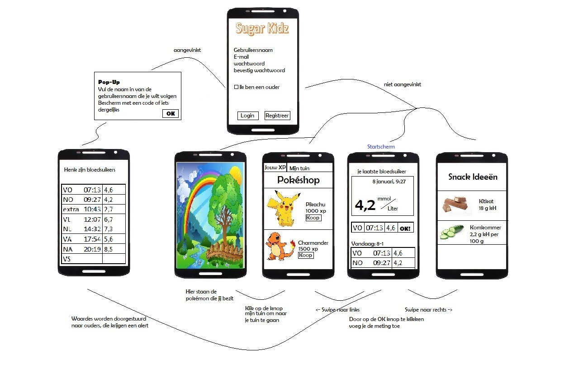

# Project Proposal
Het doel van dit document is het idee voor een project omzetten naar een echt plan. Het project moet niet te veel, en niet te weinig voorstellen en goed gedefinieerd zijn. 

## _Het probleem_
Er zijn veel jonge kinderen met diabetes. Voor deze groep kinderen bestaat er geen leuke app waarin zij hun bloedsuikers kunnen bijhouden (er bestaan wel apps voor volwassenen.) Deze app wordt ontwikkeld om het voor deze kinderen leuker te maken om hun bloedsuikers te controleren en op deze manier een betere instelling van de ziekte te bereiken (in samenwerking met de ouders/verzorgenden en hun diabetes team.)

## _De oplossing_

In de app worden kinderen gemotiveerd om 4x per dag hun bloedsuiker te checken, doordat ze XP krijgen als zij hun bloedsuikers invullen.

De belangrijkste functies van de app zijn:
1. Inloggen en registreren
1. Je eigen bloedsuikers invullen en XP verdienen
    1. Koppelen aan ouder-app en bloedsuikers doorsturen
    1. Je XP uitgeven aan nieuwe pokémon

Eventueel:
1. Alarm zetten om je bloedsuiker te checken op een bepaald moment
1. Snack-Ideeën (met veel of weinig kH)

## _Voorwaardes_
Alles dat nodig is voor deze app

### Data bronnen
RESTful pokémon API: voor alle pokémon data
De link naar Bulbasaur informatie: [link naar Bulbasaur!](http://pokeapi.co/api/v2/pokemon/1/)

Wordt gebruikt voor de plaatjes van de pokémon: daar moet je naartoe navigeren door de JSON. (Via sprites -> front_default)
[link naar Bulbasaur sprite.](https://raw.githubusercontent.com/PokeAPI/sprites/master/sprites/pokemon/1.png)

Voor de eventuele snack ideeën misschien een API maar je kan ook de gebruikers zelf een database laten maken. (Denk dat er geen API voor bestaat.)

### Externe componenten

Firebase om gegevens van gebruikers bij te houden.

### Vergelijkbare mobiele apps

_Diabetes:m_ is een app voor volwassenen om hun bloedsuikers bij te houden.

_Pokémon Go!_ is een app waarbij je pokémon kan verzamelen.

_Jerry the Bear_ is de enige app over diabetes speciaal voor kinderen. Dit is een hele andere appp dan de app die ik ga maken. Jerry heeft diabetes. Je kan zijn bloedsuiker controleren, insuline toedienen en eten geven (koolhydraten tellen.) Je doet verder niets met je eigen suikerwaardes. Deze app is in het engels.

Verder zijn er veel apps om diabetes dagboeken bij te houden en apps met koolhydraatarme recepten.

### De moeilijskte onderdelen van deze app

Het moeilijkste van de app is denk ik om een veilige manier te vinden om de app van ouder en kind te koppelen.
