# Sugar Kidz

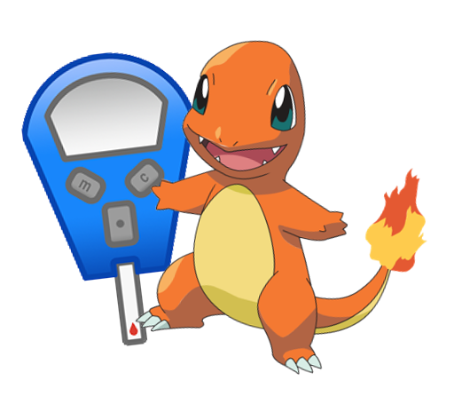

(Because this app is for Dutch children, the ReadMe is written in dutch.)

## De Applicatie
De SugarKidz app is ontwikkeld voor jonge kinderen met diabetes. Het helpt een betere controle te bereiken over deze ziekte door de kinderen aan te moedigen om hun bloedsuiker te meten en hun metingen bij te houden in deze app. Voor elke meting krijg je XP, en dit XP kan je uitgeven aan nieuwe pokemons die je kunt verzamelen en in je tuin kunt plaatsen als je ze hebt.

De app kan ook gebruikt worden door ouders om hun kind een beetje in de gaten te houden: laat je kind een koppelcode genereren en koppel jouw account aan de app van je kind. Je zult notificaties ontvangen als je kind een nieuwe meting invult.

Demonstration video: 

## Over
Sugar Kidz is gemaakt door Natasja Wezel, in het kader van het eindproject van de Minor Programmeren op de UvA, in januari 2018.
De Sugar Kidz app is beschikbaar vanaf API 21.

Better Code Hub:

## Copyright statement
De pokemons plaatjes komen uit de Open Source Pokemon API die vrij te gebruiken is voor iedereen. De meter komt uit een diabetes-emoticons app en ook die is vrij te gebruiken voor iedereen. Verder zijn in de app verschillende vrij te gebruiken (standaard) icons gebruikt.

Sugar Kidz is vrijgegeven onder de BSD licentie. Zie het LICENSE bestand voor meer informatie.

## De Sugar-Kidz app in meer detail
Je zult een account aan moeten maken als ouder of kind zijnde:

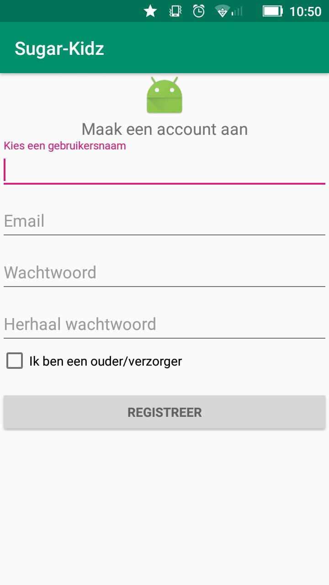

### De app voor kinderen
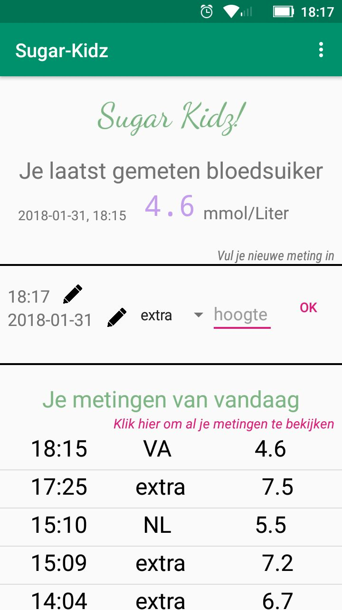  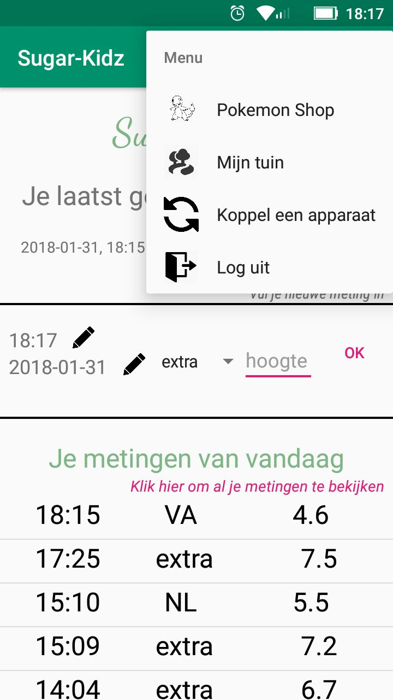

Voeg metingen toe (en verwijder eventueel metingen) in het hoofdscherm. Je kan vanaf hier ook overal heen navigeren.

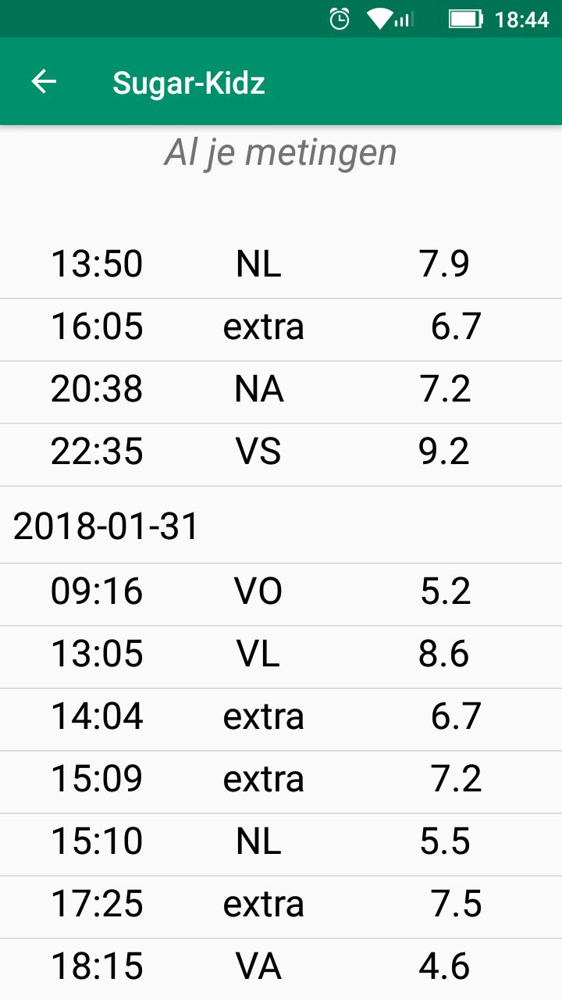  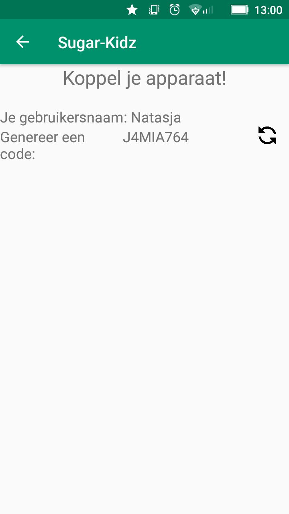

Bekijk al je metingen in het logbook, en koppel je account aan dat van je ouders via het koppelscherm

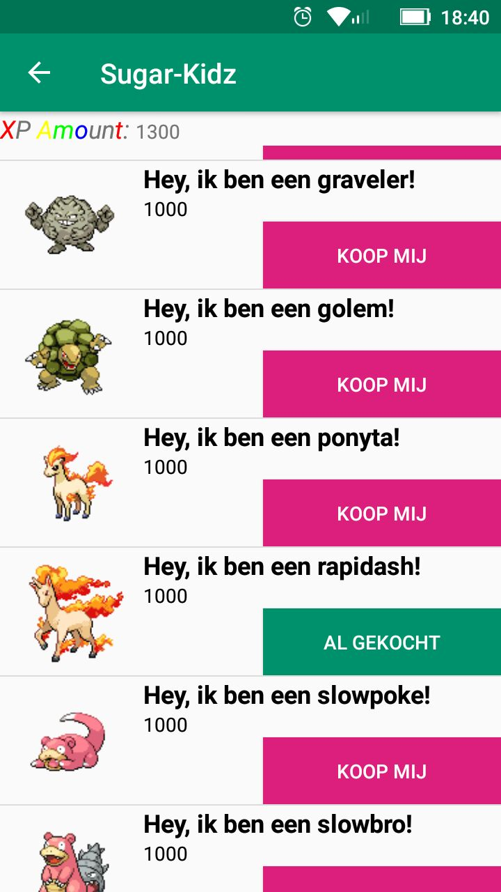  

Geef je XP uit in de Pokemon winkel en bekijk je pokemons in de tuin!

### De app voor ouders
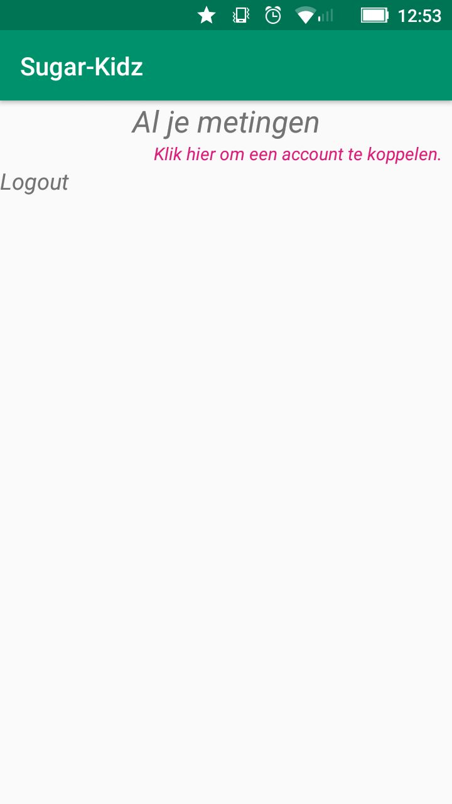  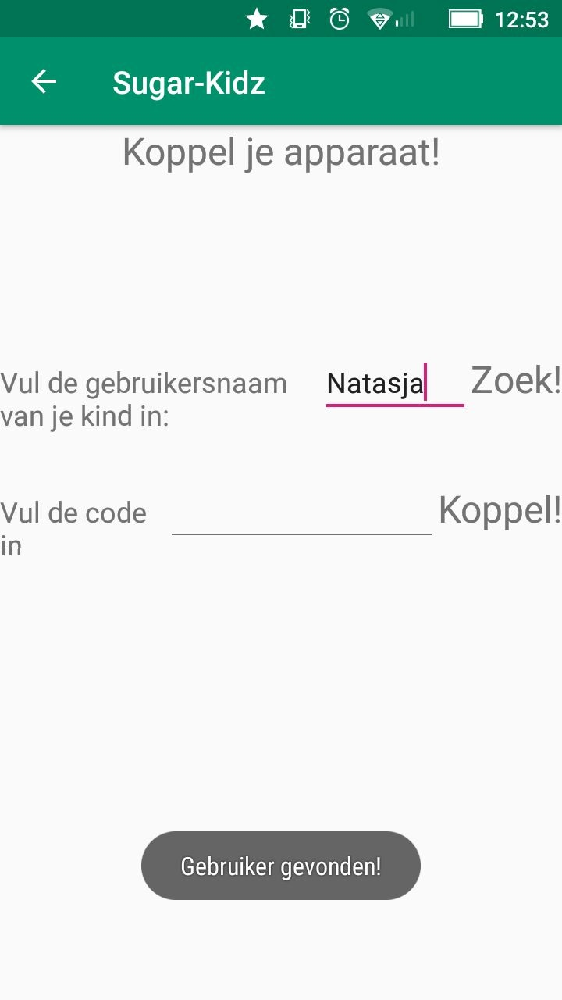

De eerste keer dat je binnenkomt in de app zul je een leeg logboek zien. Je moet je account nog koppelen aan dat van je kind.

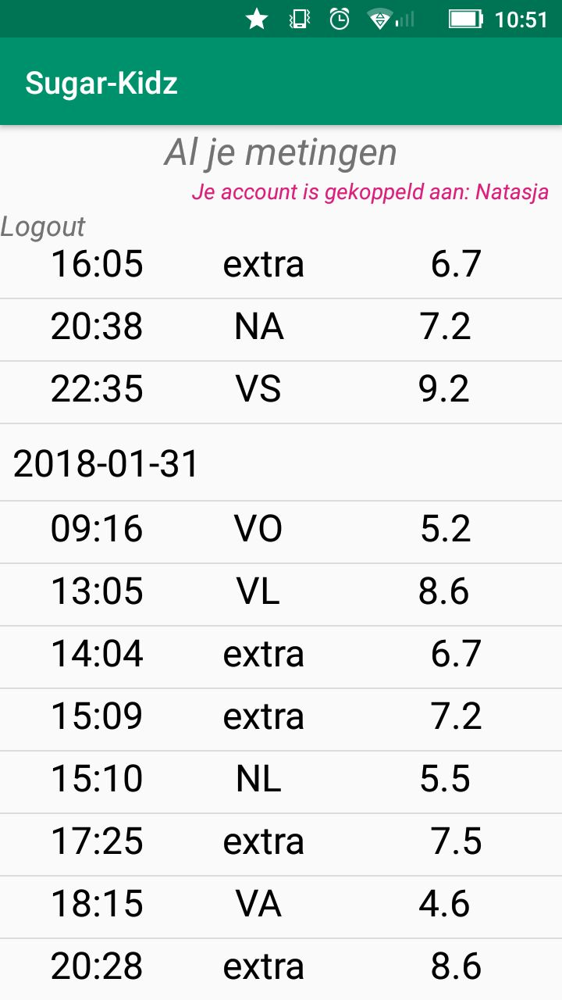  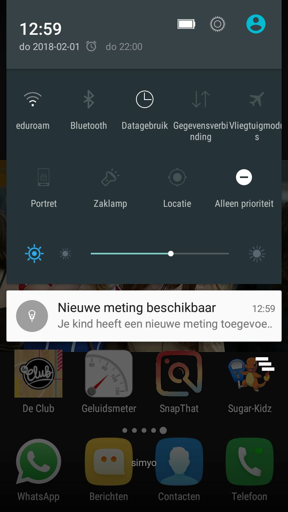

Daarna zul je het logbook van je kind zien en notificaties ontvangen als je kind een meting toevoegd.

