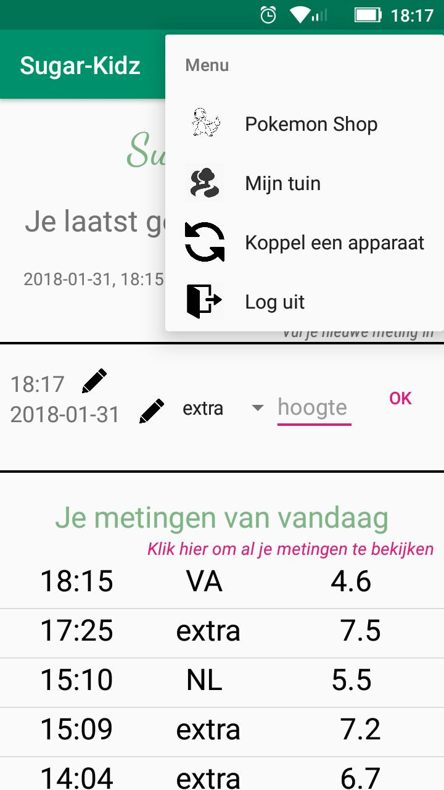

# Report

This is an application for dutch children with diabetes. The appropriate age range is 4-12 years. The application motivates the children to measure their bloodglucose and enter new measurements in the app. For each measurement they gain XP. With this XP they can buy pokemons. The pokemons can be seen in their own garden.

The application can also be used by parents. They can couple their account to their kid's account and then see their measurements. They will receive a notification if their kid enters a new measurement.

    

## 1. Technical design
Actually, my actual design really resembles the design I planned in the advanced sketch of my DESIGN.md.

I didn't go with the optional snack activities: there was too little time for that. For coupling with a parent I made an extra activity in which the kids can generate a couple code, and the parents can search for their kids by the username and couple to them, using that same code. For the logbook I used headers with the date, and I made this activity available for the kids theirselves too.

I also didn't go with the swipe listeners. They didn't work as I expected so I made a menu in the Main Activity after all.

In all activities there's checked if the user is really logged in by using the FirebaseAuth.getCurrentUser() function. Also in the logbook and in the couple activity there's checked if the user is a parent, and the UI is updated accordingly. The parent can't leave these two activities. 

### 1.1 Register/Log in Activity
You register as a user or as a parent. Here, the Firebase Authentication Database is used. There is immediately made a user account for you in the 'normal' database, in which is saved if you're a parent, using the User class.

You can off course also log in if you already have an account.

If you're a parent you'll be redirected to the logbook activity.
If you're a "normal" user, you go to the main activity.

### 1.2 Main Activity
Add new measurements to Firebase and see old measurements from Firebase, using the SimpleMeasurement and Measurement classes. Also gain XP if you've added a new measurement.
Go to the other Activities by using the menu.

### 1.3 Pokeshop Activity
Only kids can enter this activity. Here the kids can spend their XP. The pokemons they own will be added to their Database. 

All of the pokemons available are given in a listview using the Pokemon class, and a the pokemons they own have green buttons with the text "you already own this pokemon".

The pokemon are loaded from the api and saved into firebase. The API I wanted to use (and did use, but only just once) is: http://pokeapi.co/api/v2/pokemon/1/, for example. The 1 is a variable, 1 stands for pokemon one, that is, Bulbasaur.

### 1.4 MyGarden Activity
Only kids can enter this activity. In the Garden they can see their pokemons living happily and change them to another pokemon they own by clicking on them. As a change from my original proposal I added animations to the pokemons here.

### 1.5 Logbook Activity
If you're a parent and not coupled yet, you'll see an empty logbook and the option "couple your phone". Once coupled, you'll see the logbook of your kid and receive notifications as they enter new measurements.

The kids can see their own, all-time, logbook.

This logbook is made using a ListView and the Measurement class.

### 1.6 Couple Activity
In this activity the kids can see their username and create a couple code. This code is generated by the CodeGenerator class. This code is saved in FireBase for 10 minutes. 

The parent has to search their kid by their username and then couple to them by typing in the couple code they get from their kid.

### 1.7 Databases, structure
Firebase Authentication Database as Firebase creates a FirebaseAuth.

My Firebase Database has the following structure:
1. pokemons
    1. pokemon number
        1. name
        1. sprite
1. users
    1. UID
        1. username
        1. amount of XP owned (if you're a kid)
        1. boolean isParent
        1. coupled (if you're a parent)
        1. pokemon (if you're a kid)
            1. owned pokemon
                1. ints of pokemons owned
        1. displayed pokemon (if you're a kid)
              1. ints of pokemons displayed
        1. measurements (if you're a kid)
            1. date
                1. time
                    1. title of this measurement (VO,NO,VL,NL,VA,NA,VS, extra (these are dutch moments of the day that are common                              moments to measure your blood glucose))
                    1. bloodglucose in mmol/L
### 1.8 Classes
The classes that are used in this application are to simply add and receive information to firebase: we have User, SimpleMeasurement, Pokemon and Measurement.

There is also a class CodeGenerator, which is used to create the couple code parents need to link their account to their kids account.

## 2. External code
* Use of base 64:
  https://stackoverflow.com/questions/4830711/how-to-convert-a-image-into-base64-string
  https://gist.github.com/WrathChaos/80cd7e613cd7577dae9326e3cd75e4be

I did also use [Google's FireBase](https://firebase.google.com).

I used a [Pokemon API](https://pokeapi.co/).

## 3. Challenges
I've come across some serious challenges while making this application. First of all, we had to do a lot of things I didn't expect in the beginning, like every day Stand-Ups, weekly Presentations, making a StyleGuide and do (multiple) peer reviews. I noticed that with all of this going on, I couldn't really order my thoughts and make a planning for my app. It felt like I had to leave some good ideas because of the time, and that I found that a shame.

### 3.1 The Volley Problem
Volley doesn't like it when you Request multiple things at a time. This is an issue that really took long to deal with. I couldn't load my pokemons in the listview properly (see also my procces.md) I fixed this using a SerialRequestQueue, but that took about 10 minutes so I decided to save the Pokemons to Firebase and load them from there. This actually created a new issue: how to save Bitmaps to Firebase.

### 3.2 How to Save Bitmaps to FireBase
After searching pretty long, I found out you can save Bitmaps as a string to Firebase and use certain functions to encode, and decode them.

### 3.3 Listening for Internet Connection
The internet connection wasn’t easy as well, I had to use an interface to close activities from the Main Activity (and I didn’t ever us one before).

### 3.4 Animations on ImageViews and onClickListeners
Because of the animations I added to the pokemons, the pokemon could be at one side of the screen, while the onClick listener remained at the place where the ImageView really was. I tried to fix this with Renske, but this was hard and there's really little information about Android and Animations. So I fixed this with making a colored backgrounded and make sure the animations of the pokemon didn't go out of their own, colored, piece of the garden. Then I added the onClick listener to the background instead of the pokemon imageview. Then I made these backgrounds invisible (transparent.)

## 4. Choiches to do things differently
A lot of things I decided to do differently are already said in this report, and also in my process book. I will repeat those in short.
1. The swipes - they didn't work the way I expected. 
1. The snacks - there wasn't time for this so I didn't even start.
1. Background service for notifcations - background services are expiring in Android 8, so I decided not to make one. 

1. Feedback at your height. This is one thing I really don't like that I wasn't able to do it. I wanted to give a user more XP if they where in a certain range, that their parent/diabetes nurse could set. I also would have wanted to built in some messages, like "Keep up the good work!", "Measure more often!". But also give warnings if you are dangerously high or low. Like an alertdialog: "Treat your low bloodsugar before you do anything else!", or, if you're high, "Make sure to keep an eye on these high bloodsugars, and if your levels don't go lower, contact the hospital!".

1. I would've really loved if the user would've been able to set an alarm to check their bloodsugar.

1. I wanted to add some sort of small messaging service between parent and kidd to let the parent remind their kid to check their bloodsugar, or to ask them how they are feeling. It can also be used for the kids to immediately explain a high or low measurement to their parents.

### 4.1 Trade-Offs
Because there wasn't very much time, there are things that I wasn't able to do. But in the ideal world, I would build further on the app I made and add the features I thought of in the beginning. The only choice I had to make to do something different was with the swipes, and the menu isn't a Trade-Off, it's more clear. The other choices were all to not do things, because of the time.

## 5. Final thoughts
I'm pretty happy about how my app turned out. It looks nice and does what I wanted it to do. It is bug free (as far as I know, at least.) There are some more things that I wanted to add in the beginning, but it is just too much for in these 4 weeks.

